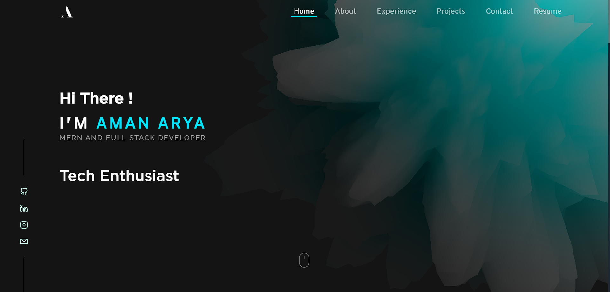

# Portfolio Website - Aman Arya

<b>Visit [Am4nn/Portfolio-Nextjs-Website](https://github.com/Am4nn/Portfolio-Nextjs-Website) github repository for the updated portfolio made using Nextjs:14 </b>

Welcome to my portfolio website built with ReactJS, Three.js, and hosted on Vercel with a custom domain [react.amanarya.com](https://react.amanarya.com)



## Overview

This project showcases my portfolio and allows visitors to view my work and send me messages directly through the website.

## Live Demo

You can see the live demo of this project at [https://react.amanarya.com](https://react.amanarya.com)

## Installation

To run this project locally, follow these steps:

1. Clone the repository:

   ```bash
   git clone https://github.com/Am4nn/Portfolio-Website.git
   ```

2. Navigate to the project directory:

    ```bash
    cd Portfolio-Website
    ```

3. Install the dependencies:

    ```bash
    npm install
    ```

4. Start the React app:

    ```bash
    npm start
    ```

5. Open your web browser and visit <http://localhost:5173/> to view the project locally.

## Features

- ReactJS: The frontend is built using ReactJS, making it highly interactive and responsive

- Three.js: Three.js is used for 3D graphics rendering, adding a visually appealing aspect to the portfolio

- Serverless API: The website uses a serverless function hosted on Vercel to handle form submissions and send emails using Nodemailer

- Custom Domain: The portfolio is hosted on a custom domain, [react.amanarya.com](https://react.amanarya.com)

## Contact

If you have any questions, feedback, or would like to get in touch with me, you can use the contact form on my portfolio or email me at <125aryaaman@gmail.com>

## License

This project is licensed under the MIT License - see the LICENSE file for details.
